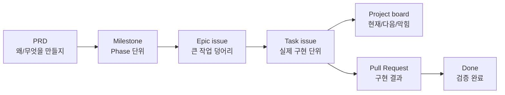
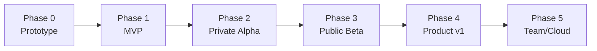
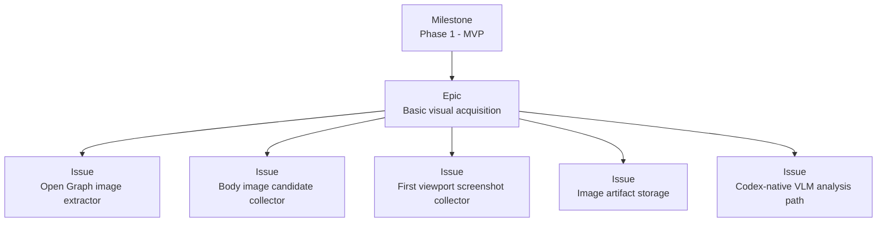
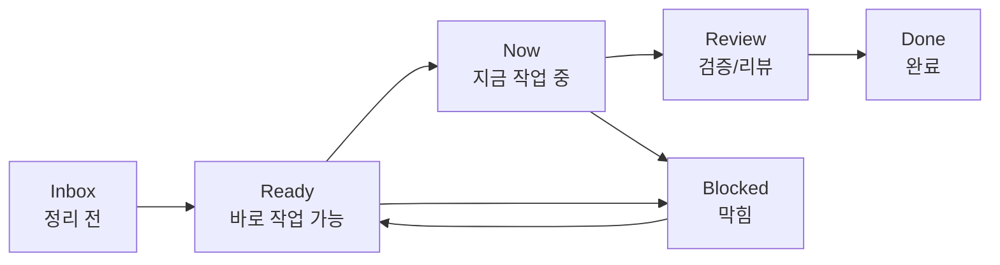
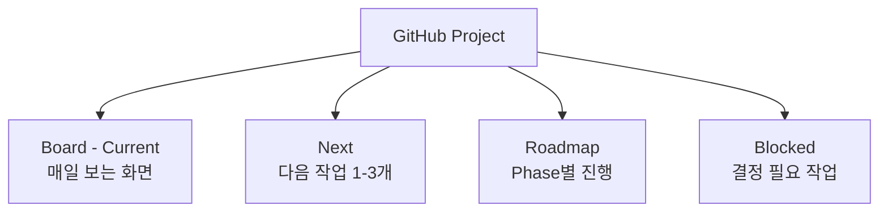
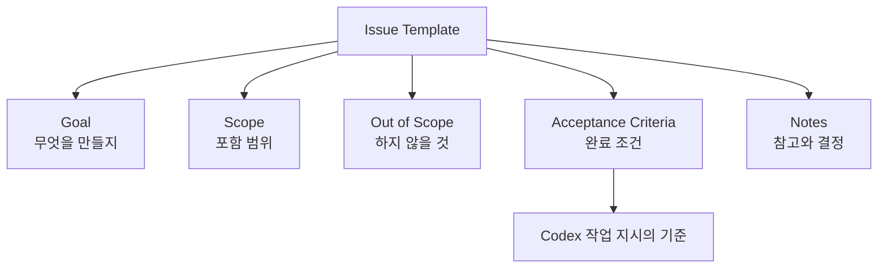
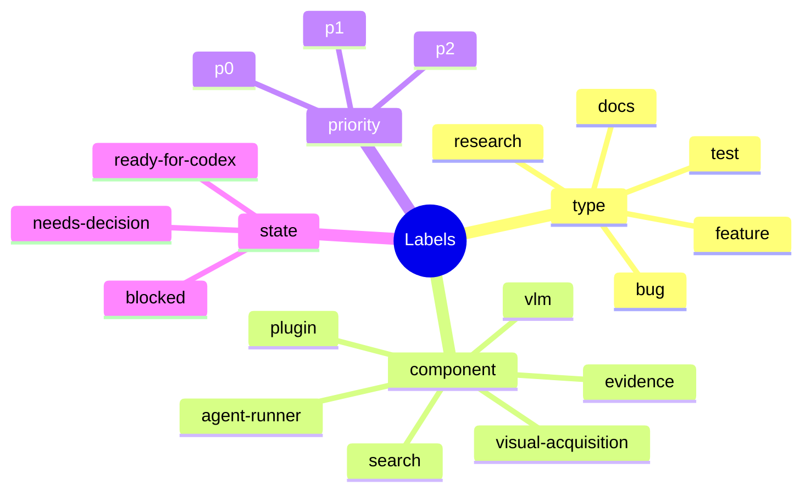
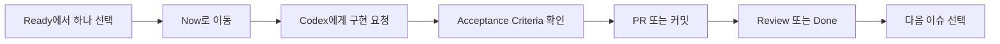
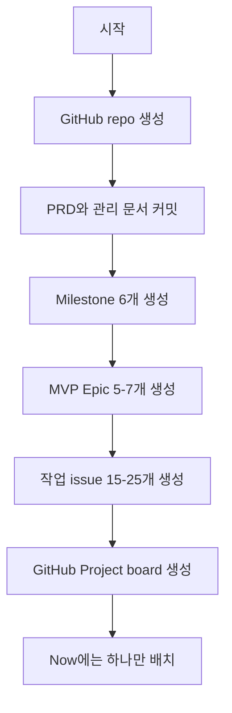

# Codex DeepResearch 개발 관리안

## 결론

Codex DeepResearch는 GitHub Issues와 GitHub Projects로 관리한다. 지금 단계에서는 Jira, Linear 같은 별도 도구보다 GitHub가 적합하다. 코드, PRD, 이슈, PR, 커밋을 한곳에 묶을 수 있기 때문이다.

핵심 원칙은 단순하다.

```text
PRD = 왜/무엇을 만들지
Milestone = 어느 Phase인지
Epic issue = 큰 덩어리
Sub-issue = 실제 작업 단위
Project board = 현재/다음/막힘 보기
PR = 구현 결과
```



## 저장 구조

```text
repo/
  docs/
    codex-deepresearch-prd.md
    codex-deepresearch-project-management.md
  src/
  tests/
  .github/
    ISSUE_TEMPLATE/
```

## GitHub 구조

### Milestones

- `Phase 0 - Prototype`
- `Phase 1 - MVP`
- `Phase 2 - Private Alpha`
- `Phase 3 - Public Beta`
- `Phase 4 - Product v1`
- `Phase 5 - Team/Cloud`



### Issue 계층

```text
Milestone: Phase 1 - MVP
  Epic: Basic visual acquisition
    Issue: Open Graph image extractor
    Issue: Body image candidate collector
    Issue: First viewport screenshot collector
    Issue: Image artifact storage
    Issue: Codex-native VLM analysis path
```



## Project Board

GitHub Project의 `Status` 필드를 아래처럼 쓴다.

```text
Inbox -> Ready -> Now -> Review -> Done
              \-> Blocked
```



상태 의미:

- `Inbox`: 아직 정리 안 된 아이디어.
- `Ready`: 바로 작업 가능한 이슈.
- `Now`: 지금 작업 중. 혼자 개발이면 1개, 많아도 2개만 둔다.
- `Review`: 구현 후 검증 또는 리뷰 중.
- `Blocked`: 결정, 권한, 기술 문제 때문에 막힘.
- `Done`: 완료.

## Project Views

GitHub Project 안에 최소 4개 view를 만든다.

1. `Board - Current`
   - Inbox / Ready / Now / Review / Blocked / Done 보드.
   - 매일 보는 기본 화면.

2. `Next`
   - 필터: `Status = Ready`
   - 우선순위 높은 작업 1-3개만 남긴다.

3. `Roadmap`
   - Phase/Milestone 기준 보기.
   - MVP가 어느 정도 왔는지 확인한다.

4. `Blocked`
   - 필터: `Status = Blocked` 또는 label `blocked`.
   - 막힌 결정만 모아 본다.



## Issue Template

모든 이슈는 아래 형식을 따른다.

```md
## Goal
무엇을 만들거나 고칠지

## Scope
이번 이슈에 포함되는 것

## Out of Scope
이번 이슈에서 하지 않을 것

## Acceptance Criteria
- [ ] 조건 1
- [ ] 조건 2
- [ ] 테스트/검증 방법

## Notes
관련 PRD 섹션, 참고 파일, 의사결정 메모
```

`Acceptance Criteria`는 "이 작업이 끝났다고 말할 수 있는 조건"이다. Codex에게 이슈를 맡길 때 가장 중요한 부분이다.



## Label 체계

처음에는 label을 적게 둔다.

```text
type:feature
type:bug
type:research
type:docs
type:test

component:search
component:visual-acquisition
component:vlm
component:evidence
component:agent-runner
component:plugin

priority:p0
priority:p1
priority:p2

blocked
needs-decision
ready-for-codex
```

상태는 label보다 Project의 `Status` 필드로 관리한다. Label은 분류용, Status는 진행 상태용이다.



## 일일 개발 루틴

```text
1. Ready에서 가장 중요한 이슈 하나를 고른다.
2. 그 이슈를 Now로 옮긴다.
3. Codex에게 이슈 하나만 구현시킨다.
4. Acceptance Criteria를 확인한다.
5. PR 또는 커밋을 만든다.
6. Review 또는 Done으로 옮긴다.
7. 다음 이슈 하나를 Now로 옮긴다.
```



Codex에게 줄 프롬프트 예시:

```text
Issue #12를 구현해줘.
Scope 밖 작업은 하지 말고,
Acceptance Criteria를 모두 만족하는지 검증해줘.
완료 후 변경 파일과 테스트 결과를 요약해줘.
```

## 다른 방식에서 배울 점

### GitHub Issues / Projects

GitHub는 Issues, sub-issues, labels, milestones, projects를 함께 쓰는 구조를 제공한다. Projects는 table, board, roadmap 형태로 볼 수 있어서 이 프로젝트의 기본 관리 도구로 적합하다.

### GitLab Issue Boards

GitLab도 이슈를 카드로 보고 label, milestone, assignee로 workflow를 관리한다. 핵심은 GitHub와 같다. 작업을 카드로 만들고 상태별로 이동시키는 것이다.

### Shape Up

Basecamp의 Shape Up에서 배울 점은 "고정 시간, 가변 범위"다. 기간을 계속 늘리는 대신, 정해진 기간 안에 들어갈 만큼 범위를 줄인다. 예를 들어 MVP에서 시간이 부족하면 `full-page screenshot`을 Phase 2로 미루고, `first viewport screenshot`만 남긴다.

## 최소 시작안

1. GitHub repo 생성.
2. PRD를 `docs/codex-deepresearch-prd.md`로 커밋.
3. 이 문서를 `docs/codex-deepresearch-project-management.md`로 커밋.
4. Milestone 6개 생성.
5. Phase 1 MVP Epic issue 5-7개 생성.
6. MVP 작업 issue 15-25개 생성.
7. GitHub Project board 생성.
8. `Now`에는 하나만 넣고 시작.



## 성공 기준

- 현재 작업이 무엇인지 5초 안에 보인다.
- 다음 작업 1-3개가 명확하다.
- 막힌 작업이 따로 보인다.
- Codex에게 줄 수 있는 이슈 단위로 작업이 쪼개져 있다.
- 완료 여부가 Acceptance Criteria로 판단된다.

## 참고 링크

- GitHub Issues quickstart: https://docs.github.com/en/issues/tracking-your-work-with-issues/learning-about-issues/quickstart
- GitHub Projects: https://docs.github.com/issues/planning-and-tracking-with-projects/learning-about-projects/about-projects
- GitHub Roadmap layout: https://docs.github.com/en/issues/planning-and-tracking-with-projects/customizing-views-in-your-project/customizing-the-roadmap-layout
- GitLab Issue Boards: https://docs.gitlab.com/user/project/issue_board/
- Shape Up: https://basecamp.com/shapeup
