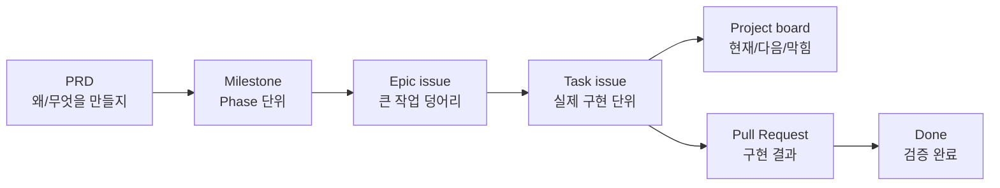
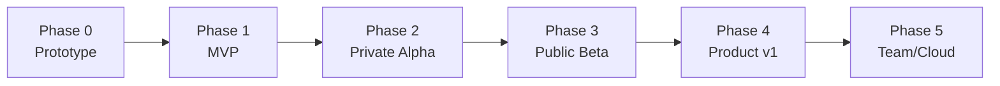
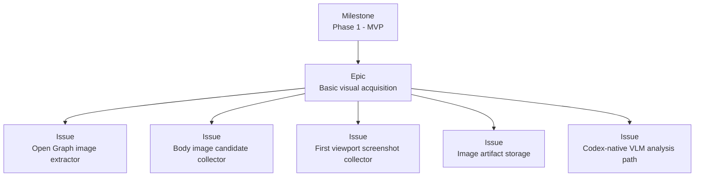
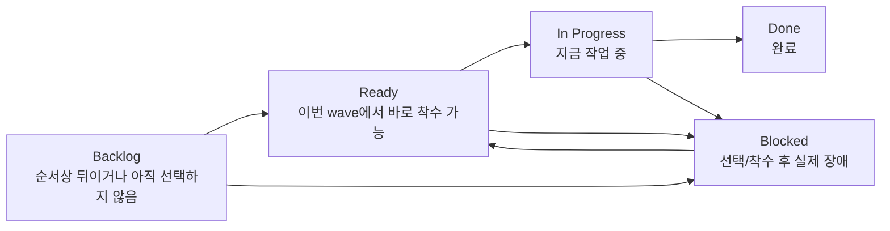
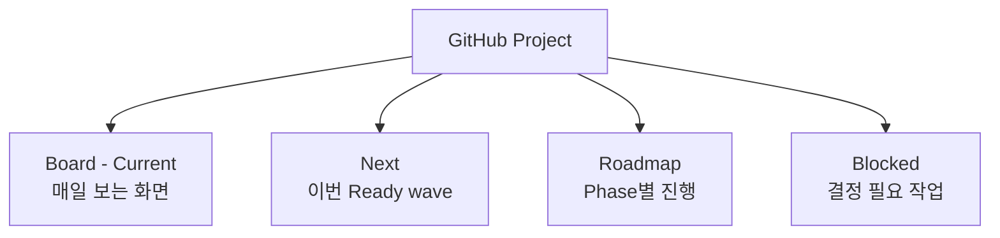
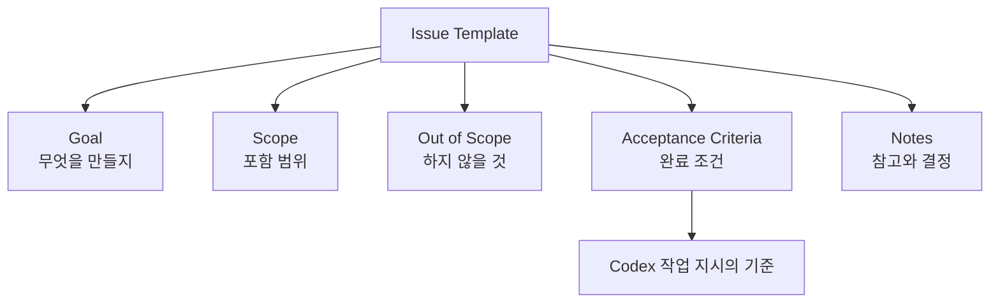
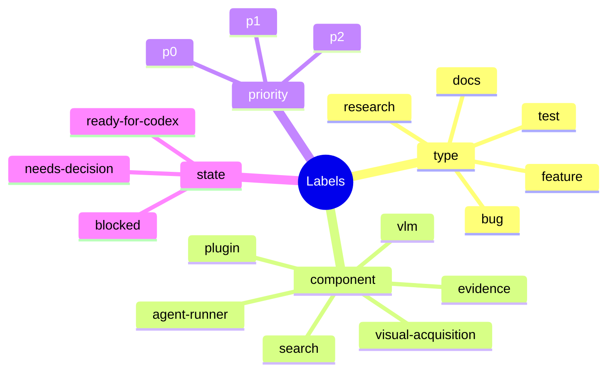
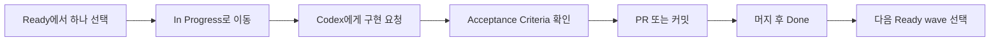
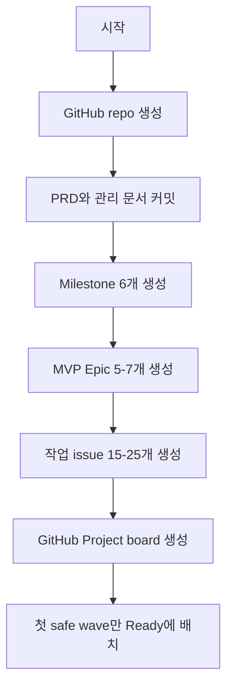

# Codex DeepResearch 개발 관리안

## 결론

Codex DeepResearch는 GitHub Issues와 GitHub Projects로 관리한다. 지금 단계에서는 Jira, Linear 같은 별도 도구보다 GitHub가 적합하다. 코드, PRD, 이슈, PR, 커밋을 한곳에 묶을 수 있기 때문이다.

핵심 원칙은 단순하다.

```text
PRD = 왜/무엇을 만들지
Milestone = 어느 Phase인지
Epic issue = 큰 덩어리
Sub-issue = 실제 작업 단위
Project board = 현재/다음/막힘 보기
PR = 구현 결과
```



## 저장 구조

```text
repo/
  docs/
    codex-deepresearch-prd.md
    codex-deepresearch-project-management.md
  src/
  tests/
  .github/
    ISSUE_TEMPLATE/
```

## GitHub 구조

### Milestones

- `Phase 0 - Prototype`
- `Phase 1 - MVP`
- `Phase 2 - Private Alpha`
- `Phase 3 - Public Beta`
- `Phase 4 - Product v1`
- `Phase 5 - Team/Cloud`



### Issue 계층

```text
Milestone: Phase 1 - MVP
  Epic: Basic visual acquisition
    Issue: Open Graph image extractor
    Issue: Body image candidate collector
    Issue: First viewport screenshot collector
    Issue: Image artifact storage
    Issue: Codex-native VLM analysis path
```



## Project Board

GitHub Project는 두 종류의 상태를 구분해서 쓴다.

- `Status`: GitHub Project 기본 생명주기. `Todo`, `In Progress`, `Done`.
- `Workflow Status`: 실제 작업 큐. `Backlog`, `Ready`, `In Progress`, `Blocked`, `Done`.

`Status`는 큰 진행 상태만 나타내고, 개발 순서와 착수 가능 여부는 `Workflow Status`가 담당한다.

```text
Backlog -> Ready -> In Progress -> Done
    \         \-> Blocked
     \------------^
```



상태 의미:

- `Backlog`: 개발 순서상 뒤에 있거나, 병렬 가능하더라도 이번 wave로 선택하지 않은 작업. unresolved hard blocker가 있는 미착수 작업도 여기에 둔다.
- `Ready`: 현재 안전하게 착수할 수 있는 다음 wave. 병렬 작업은 충돌 위험과 리뷰 부담이 낮을 때만 함께 둔다.
- `In Progress`: 구현 중인 작업. 시작 시 `Status=In Progress`, `Workflow Status=In Progress`로 맞춘다.
- `Blocked`: 선택되었거나 시작된 작업이 실패한 실행, 외부 결정, 권한, credential, 환경 문제 등 실제 장애 때문에 더 진행할 수 없는 상태.
- `Done`: PR 머지 또는 이슈 종료 후 완료 상태. `Status=Done`, `Workflow Status=Done`로 맞춘다.

개발 순서는 항상 이슈 본문의 `Dependencies / Ordering`에 전체 문맥을 적는다. GitHub dependency는 hard blocker에만 건다. soft ordering은 본문과 Project `Workflow Status=Backlog`로 표현하며, `Blocked`로 표시하지 않는다.

## Project Views

GitHub Project 안에 최소 4개 view를 만든다.

1. `Board - Current`
   - `Workflow Status` 기준 Backlog / Ready / In Progress / Blocked / Done 보드.
   - 매일 보는 기본 화면.

2. `Next`
   - 필터: `Workflow Status = Ready`
   - 이번 wave에서 안전하게 착수할 작업만 둔다.

3. `Roadmap`
   - Phase/Milestone 기준 보기.
   - MVP가 어느 정도 왔는지 확인한다.

4. `Blocked`
   - 필터: `Workflow Status = Blocked` 또는 label `blocked`.
   - 선택/착수 후 실제로 막힌 결정과 환경 문제만 모아 본다.



## Issue Template

모든 이슈는 아래 형식을 따른다.

```md
## Goal
무엇을 만들거나 고칠지

## Scope
이번 이슈에 포함되는 것

## Out of Scope
이번 이슈에서 하지 않을 것

## Acceptance Criteria
- [ ] 조건 1
- [ ] 조건 2
- [ ] 테스트/검증 방법

## Notes
관련 PRD 섹션, 참고 파일, 의사결정 메모
```

`Acceptance Criteria`는 "이 작업이 끝났다고 말할 수 있는 조건"이다. Codex에게 이슈를 맡길 때 가장 중요한 부분이다.



## Label 체계

처음에는 label을 적게 둔다.

```text
type:feature
type:bug
type:research
type:docs
type:test

component:search
component:visual-acquisition
component:vlm
component:evidence
component:agent-runner
component:plugin

priority:p0
priority:p1
priority:p2

blocked
needs-decision
ready-for-codex
```

상태는 label보다 Project의 `Status` 필드로 관리한다. Label은 분류용, Status는 진행 상태용이다.



## 일일 개발 루틴

```text
1. Ready에서 가장 중요한 이슈 하나를 고른다.
2. 그 이슈를 In Progress로 옮긴다.
3. Codex에게 이슈 하나만 구현시킨다.
4. Acceptance Criteria를 확인한다.
5. PR 또는 커밋을 만든다.
6. 리뷰 중에는 In Progress를 유지하고, 머지 후 Done으로 옮긴다.
7. 다음 Ready wave를 선택한다.
```



Codex에게 줄 프롬프트 예시:

```text
Issue #12를 구현해줘.
Scope 밖 작업은 하지 말고,
Acceptance Criteria를 모두 만족하는지 검증해줘.
완료 후 변경 파일과 테스트 결과를 요약해줘.
```

## Project 동기화 검증 루틴

Project 상태를 수동으로 바꾼 뒤에는 아래 verifier를 먼저 실행한다. 이 명령은 read-only이며 기존 `gh` 인증 세션만 사용한다.

```bash
python3 scripts/verify_github_project.py --project-owner r0feynman --project-number 1
```

검증 대상:

- 닫힌 이슈는 `Status=Done`, `Workflow Status=Done`이어야 한다.
- unresolved hard blocker가 있는 미착수 이슈는 `Ready`나 `Blocked`가 아니라 `Backlog`이어야 한다.
- 현재 safe wave만 `Ready`이어야 하고, later/deferred wave는 `Backlog`이어야 한다.
- `Blocked`는 선택되었거나 시작된 작업의 실제 impediment에만 쓴다.
- Project policy에 열거된 이슈는 모두 Project item으로 존재해야 한다.
- 이슈 본문의 hard blocker 계획과 GitHub dependency API 상태가 맞아야 한다.
- OR-shaped soft dependency policy는 candidate 이슈 존재 여부와 group 형태를 검증하며, OR candidate는 GitHub hard blocker로 만들지 않는다.
- Project field가 지원하는 값은 이슈 본문의 `Metadata / Project Plan`과 맞아야 한다. Project operations 이슈처럼 `Phase`나 `Component`가 의도적으로 비어 있는 경우는 blank 상태를 유지한다.

안전한 Project field 보정만 자동 적용하려면 maintainer가 로컬에서 아래 명령을 실행한다. 이 명령은 dependency link를 만들거나 지우지 않고, 임의의 이슈를 `In Progress`로 옮기지 않는다. 적용 후에는 Project/GitHub state를 다시 읽어 `After` mismatch를 계산하며, 수동 조치가 필요한 mismatch가 남아 있으면 non-zero로 종료한다.

```bash
python3 scripts/sync_github_project.py --project-owner r0feynman --project-number 1 --apply
```

실행 시점:

1. 이슈 생성 후: Project item 추가, field 설정, hard blocker dependency link 설정을 끝낸 뒤 verifier를 실행한다. safe field mismatch만 있으면 `sync --apply` 후 verifier를 다시 실행한다. dependency mismatch는 수동으로 고친다.
2. 구현 시작 시: coordinator가 선택한 이슈를 `Status=In Progress`, `Workflow Status=In Progress`로 옮긴 뒤 verifier를 실행한다.
3. PR 머지 시: 이슈가 닫힌 뒤 `sync --apply`로 닫힌 이슈의 `Done` field를 맞추고 verifier를 다시 실행한다.
4. post-merge cleanup 후: fetch/prune, target branch fast-forward, merged branch 삭제까지 끝낸 뒤 verifier를 한 번 더 실행해 Project 상태가 남은 작업 wave와 맞는지 확인한다.

## 다른 방식에서 배울 점

### GitHub Issues / Projects

GitHub는 Issues, sub-issues, labels, milestones, projects를 함께 쓰는 구조를 제공한다. Projects는 table, board, roadmap 형태로 볼 수 있어서 이 프로젝트의 기본 관리 도구로 적합하다.

### GitLab Issue Boards

GitLab도 이슈를 카드로 보고 label, milestone, assignee로 workflow를 관리한다. 핵심은 GitHub와 같다. 작업을 카드로 만들고 상태별로 이동시키는 것이다.

### Shape Up

Basecamp의 Shape Up에서 배울 점은 "고정 시간, 가변 범위"다. 기간을 계속 늘리는 대신, 정해진 기간 안에 들어갈 만큼 범위를 줄인다. 예를 들어 MVP에서 시간이 부족하면 `full-page screenshot`을 Phase 2로 미루고, `first viewport screenshot`만 남긴다.

## 최소 시작안

1. GitHub repo 생성.
2. PRD를 `docs/codex-deepresearch-prd.md`로 커밋.
3. 이 문서를 `docs/codex-deepresearch-project-management.md`로 커밋.
4. Milestone 6개 생성.
5. Phase 1 MVP Epic issue 5-7개 생성.
6. MVP 작업 issue 15-25개 생성.
7. GitHub Project board 생성.
8. 첫 safe wave만 `Ready`에 두고 시작.



## 성공 기준

- 현재 작업이 무엇인지 5초 안에 보인다.
- 다음 작업 1-3개가 명확하다.
- 막힌 작업이 따로 보인다.
- Codex에게 줄 수 있는 이슈 단위로 작업이 쪼개져 있다.
- 완료 여부가 Acceptance Criteria로 판단된다.

## 참고 링크

- GitHub Issues quickstart: https://docs.github.com/en/issues/tracking-your-work-with-issues/learning-about-issues/quickstart
- GitHub Projects: https://docs.github.com/issues/planning-and-tracking-with-projects/learning-about-projects/about-projects
- GitHub Roadmap layout: https://docs.github.com/en/issues/planning-and-tracking-with-projects/customizing-views-in-your-project/customizing-the-roadmap-layout
- GitLab Issue Boards: https://docs.gitlab.com/user/project/issue_board/
- Shape Up: https://basecamp.com/shapeup
